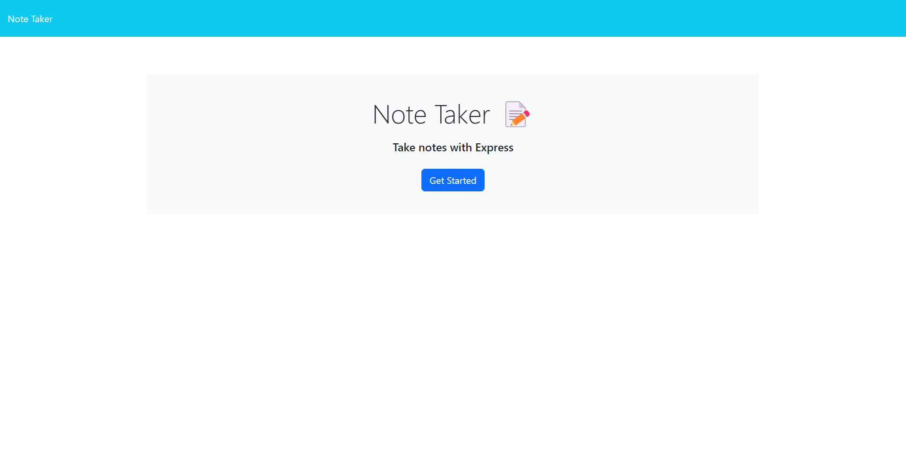
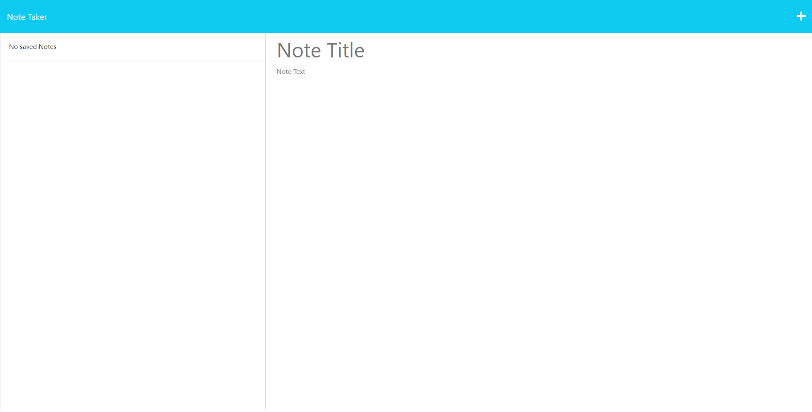
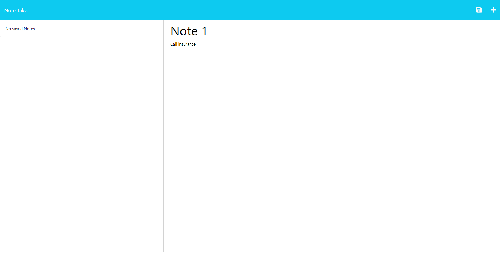
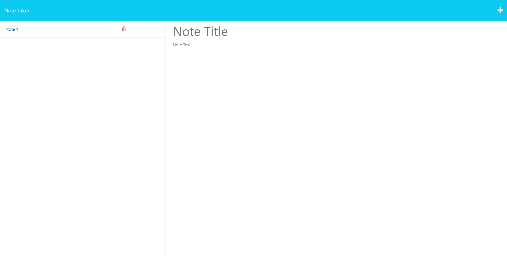

# Note-Taker

## Description
This Note-Taker App helps the user to organize and keep track of activities, ideas, thoughts that need to be completed.
Express.js is a free open source backend software, it helped building this app managing server and routes to display the webpages and their content.

## Installation
Node Module Packages installed: "express.js" to connect to the server and "uuid" package to give a unique id to each note created.

- Commands to install npm packages:
- npm install express
- npm install uuid
- npm start 
Note: npm start, command, is used to run the application and connect to the server.

## Usage
Heroku URL: https://note-task-taker.herokuapp.com/

- The user is going to be taken to the homepage where once start buttons is clicked, notes-page will be display where the user is going to be able to keep track of notes

- On the right side of the page the user will be prompted text areas to add a title and text for the new note to be saved on the system, on the upper corner the user will find an icon to save the new note and automatically will be stored to the right side of the page where once saved, the user can either delete or edit the note added. To delete note, the user will have to click on the "trash can" icon.

## Credits
https://www.freecodecamp.org/
https://expressjs.com/
Tutor: Jose Lopez

## License
MIT License

Copyright (c) [2023] [Ulises_Garfias]

Permission is hereby granted, free of charge, to any person obtaining a copy
of this software and associated documentation files (the "Software"), to deal
in the Software without restriction, including without limitation the rights
to use, copy, modify, merge, publish, distribute, sublicense, and/or sell
copies of the Software, and to permit persons to whom the Software is
furnished to do so, subject to the following conditions:

The above copyright notice and this permission notice shall be included in all
copies or substantial portions of the Software.

THE SOFTWARE IS PROVIDED "AS IS", WITHOUT WARRANTY OF ANY KIND, EXPRESS OR
IMPLIED, INCLUDING BUT NOT LIMITED TO THE WARRANTIES OF MERCHANTABILITY,
FITNESS FOR A PARTICULAR PURPOSE AND NONINFRINGEMENT. IN NO EVENT SHALL THE
AUTHORS OR COPYRIGHT HOLDERS BE LIABLE FOR ANY CLAIM, DAMAGES OR OTHER
LIABILITY, WHETHER IN AN ACTION OF CONTRACT, TORT OR OTHERWISE, ARISING FROM,
OUT OF OR IN CONNECTION WITH THE SOFTWARE OR THE USE OR OTHER DEALINGS IN THE
SOFTWARE.